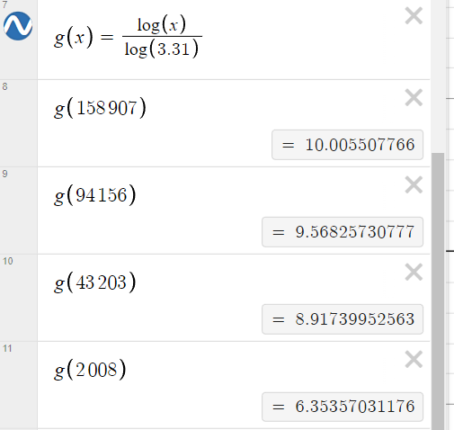
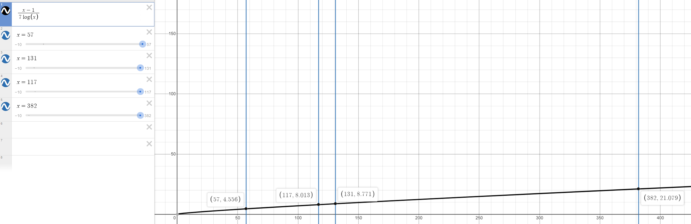
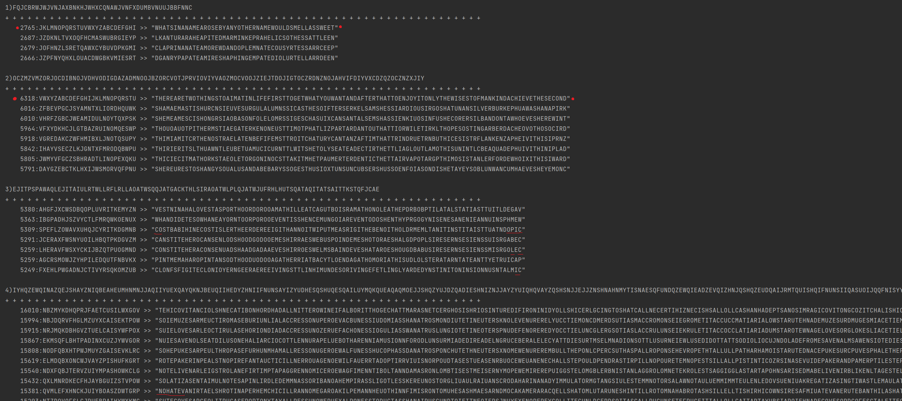
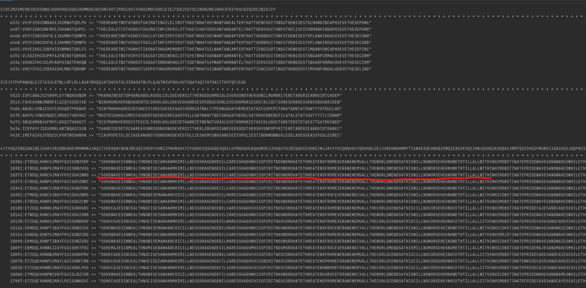
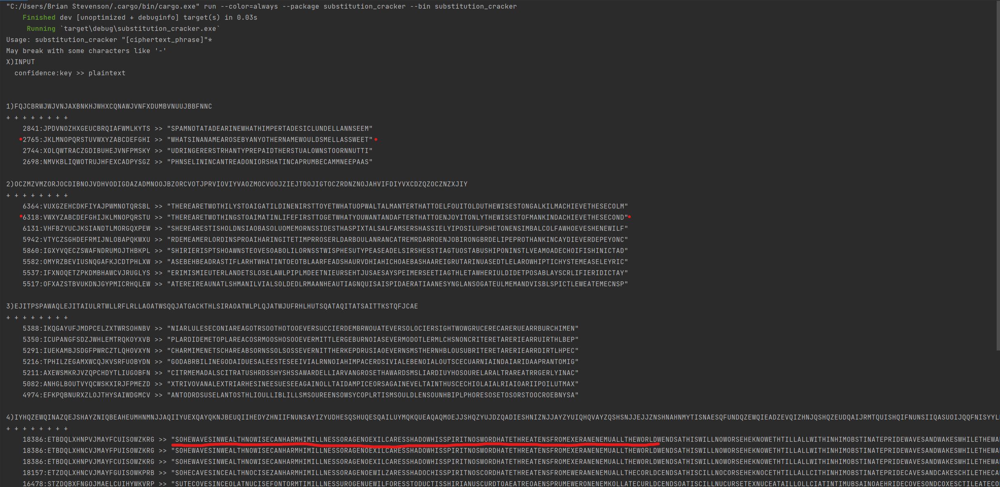

crack.txt contains my results for the four strings without keys as instructed, but are here too:  
WHATSINANAMEAROSEBYANYOTHERNAMEWOULDSMELLASSWEET  
THEREARETWOTHINGSTOAIMATINLIFEFIRSTTOGETWHATYOUWANTANDAFTERTHATTOENJOYITONLYTHEWISESTOFMANKINDACHIEVETHESECOND  
CHARMIMENETSCHAREABSORNSSOLSOSSEVERNITTHERKEPDRUSIAOEVERNSMSTHERNHBLOUSUBRITERETARERIEARRDIRTLHPEC  
SOHEWAVESINWEALTHNOWISECANHARMHIMILLNESSORAGENOEXILCARESSHADOWHISSPIRITNOSWORDHATETHREATENSFROMEXERANENEMUALLTHEWORLDWENDSATHISWILLNOWORSEHEKNOWETHTILLALLWITHINHIMOBSTINATEPRIDEWAVESANDWAKESWHILETHEWARDENSLYMBERSTHESPIRITSSENTRUSLEEPISTOOFASTWHICHMASTERSHISMIGHTANDTHEMYRDERERNEARSSTEALTHILUSHOOTINGTHESHAFTSFROMHISBOW  

Smaller programs available in substitution_encrypter and substitution_decrypter folders.
	cracker available.//??
You can directly compile and run them by going into the directory like substitution_encrypter and running 'cargo run [key] "[literature]"'
Otherwise, you can compile with 'cargo build --release' and proceed to run the executables like normal in target/release/substitution_encrypter [key] "[literature]"
My small programs take the key before the message. 

Here's my keys for each message and the resulting cipher text:  
1: SACPNVXUFYJRWGBQOLIHZDKTME  
UN KUB VFXUHI KFHU WBGIHNLI IUBZRP RBBJ HB FH HUSH UN UFWINRV PBNI GBH ANCBWN S WBGIHNL. SGP FV MBZ XSEN RBGX FGHB SG SAMII, HUN SAMII SRIB XSENI FGHB MBZ.

2: WVGKYMDUSNZQFLHORJTPXECBAI  
PUYJY ST W PUYHJA CUSGU TPWPYT PUWP SM YEYJ WLAVHKA KSTGHEYJT YBWGPQA CUWP PUY XLSEYJTY ST MHJ WLK CUA SP ST UYJY, SP CSQQ SLTPWLPQA KSTWOOYWJ WLK VY JYOQWGYK VA THFYPUSLD YEYL FHJY VSIWJJY WLK SLYBOQSGWVQY. PUYJY ST WLHPUYJ PUYHJA CUSGU TPWPYT PUWP PUST UWT WQJYWKA UWOOYLYK.

3: FXLYEJPOTVWMDIRUBAGQHSNKZC  
NOEIESEA T JTIY DZGEMJ PARNTIP PATD FXRHQ QOE DRHQO; NOEIESEA TQ TG F YFDU, YATCCMZ IRSEDXEA TI DZ GRHM; NOEIESEA T JTIY DZGEMJ TISRMHIQFATMZ UFHGTIP XEJRAE LRJJTI NFAEORHGEG, FIY XATIPTIP HU QOE AEFA RJ ESEAZ JHIEAFM T DEEQ; FIY EGUELTFMMZ NOEIESEA DZ OZURG PEQ GHLO FI HUUEA OFIY RJ DE, QOFQ TQ AEBHTAEG F GQARIP DRAFM UATILTUME QR UAESEIQ DE JARD YEMTXEAFQEMZ GQEUUTIP TIQR QOE GQAEEQ, FIY DEQORYTLFMMZ WIRLWTIP UERUME'G OFQG RJJ - QOEI, T FLLRHIQ TQ OTPO QTDE QR PEQ QR GEF FG GRRI FG T LFI.

I had to look up who said these quotes. 

I took a dictionary from /usr/dict/words to form dict.txt
Using this dictionary and works from 'Project Gutenberg' https://www.gutenberg.org/ I've formed a trigram dictionary with an integer for quantity of appearances.

In my program I give each trigram a weight 0..=100  
Trigrams are extremely useful because they are a way to O(n) rank a string (my previous O(n^2^) method was too slow especially for the fourth ciphertext. Furthermore, they allow me to match and score based on character patterns rather than words, so I don't need a word to exist in my dictionary to rank it. I'd say a weakness might be they might have trouble determining the start and end of words, and might use the end of 'word a' and the beginning of 'word b' to match a trigram. Furthermore, they might highly rank a non-sensical string much higher than a real word, because the trigrams of the nonsense can be ranked higher than the trigrams of the real word.    
Here's the weights for a few frequencies.   

This next curve describes how many top 'x' results to display given the characters in the ciphertext

I've left a screenshot from when I simply weakened the hillclimb to less iterations. There's clearly something wrong with my scoring method, otherwise my correct caesar cipher results would still display despite increasing the rounds of hillclimbing. 

Above is using a weaker hillclimb, and I got the first two ciphers correct. Below is using a stronger hillclimb. 

I may or may not tune my scoring algorithm, I'm pretty busy. 

 

Here's my program with a balanced strength of hillclimbing so the first two ciphers still display results, however I only see a little success with the fourth and none with the third. 
